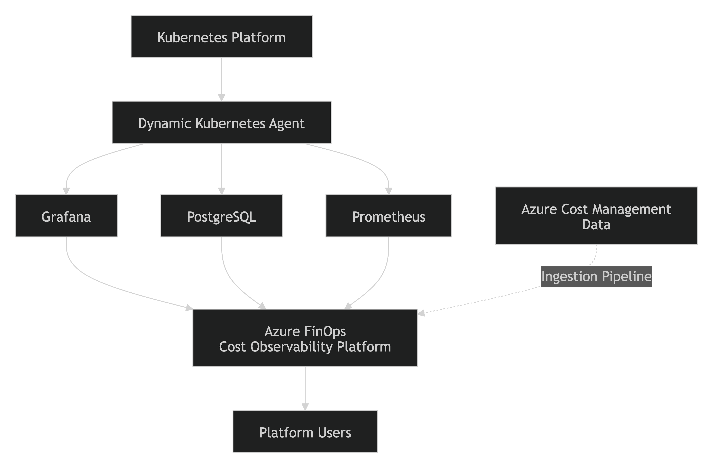
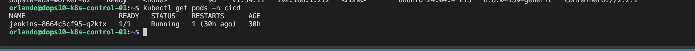
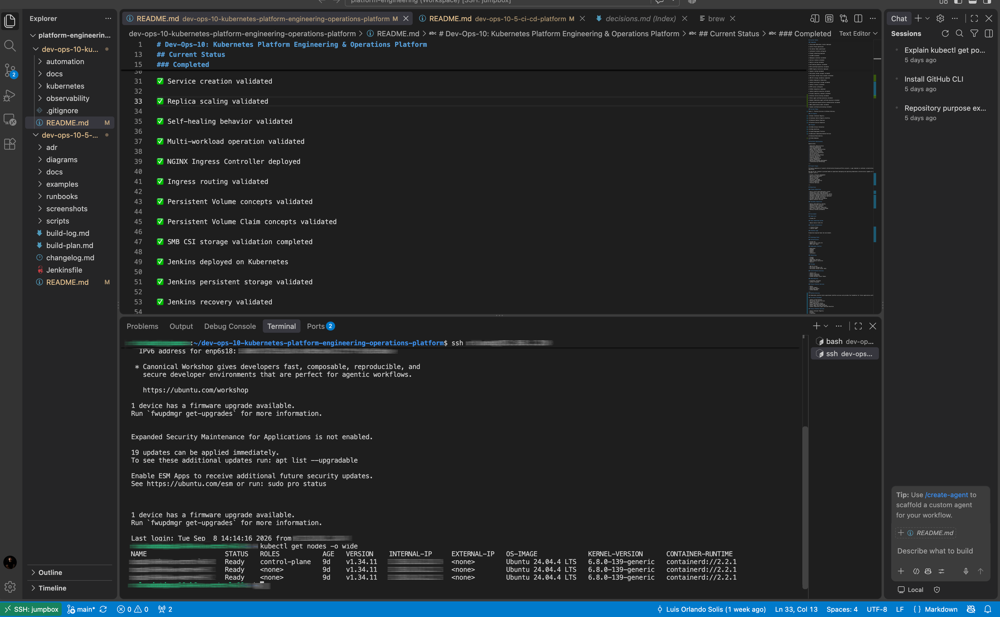
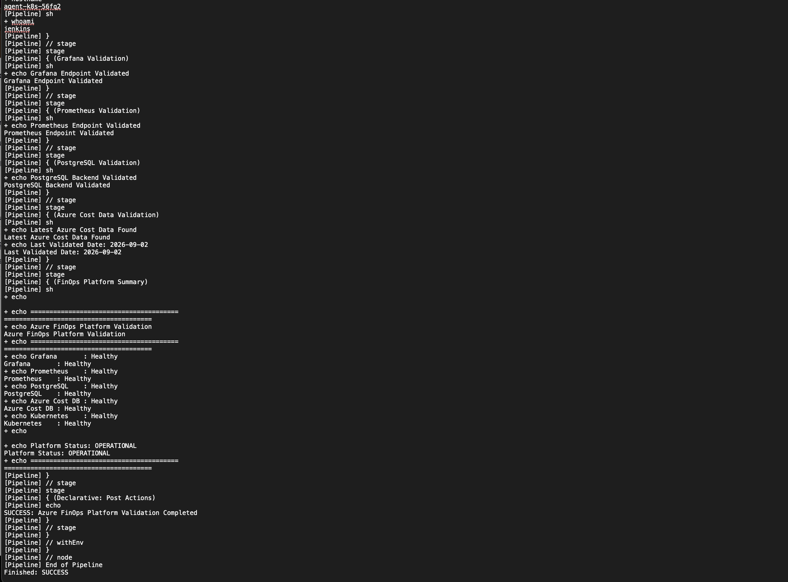
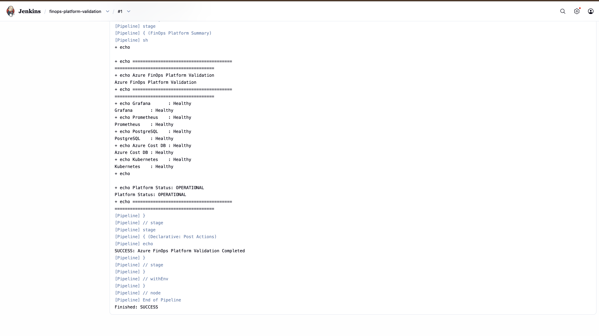

# Dev-Ops-10: Kubernetes Platform Engineering & Operations Platform



## Overview

Dev-Ops-10 is a platform engineering project focused on the design, deployment, operation, automation, monitoring, and validation of a multi-node Kubernetes environment.

The project expands upon previous portfolio work in infrastructure automation, backup and recovery, deployment operations, and infrastructure engineering by introducing cloud-native orchestration, persistent storage, ingress routing, CI/CD workflows, and platform services.

Rather than serving as a simple Kubernetes lab, the platform simulates production-inspired operational practices and provides a foundation for observability, CI/CD, application hosting, and future platform automation services.

---

## Current Status

### Completed

✅ Three-node Kubernetes cluster deployed

✅ Control Plane operational

✅ Two Worker Nodes operational

✅ containerd runtime configured

✅ Flannel networking deployed

✅ CoreDNS validated

✅ Namespace isolation validated

✅ Service creation validated

✅ Replica scaling validated

✅ Self-healing behavior validated

✅ Multi-workload operation validated

✅ NGINX Ingress Controller deployed

✅ Ingress routing validated

✅ Persistent Volume concepts validated

✅ Persistent Volume Claim concepts validated

✅ SMB CSI storage validation completed

✅ Jenkins deployed on Kubernetes

✅ Jenkins persistent storage validated

✅ Jenkins recovery validated

✅ HTTPS access configured

✅ GitHub integration completed

✅ Jenkins pipeline execution validated

✅ Private repository checkout validated

✅ Platform service hosting validated

✅ Static agent workload execution validated

✅ Dynamic Kubernetes agent workload execution validated

✅ ServiceAccount-based platform authentication validated

✅ RBAC authorization model validated

✅ Dynamic workload provisioning validated

### Current Phase

Phase 6 - Platform Services & Software Delivery

### In Progress

🚧 Harbor Container Registry

🚧 Container Build & Registry Workflow

🚧 Advanced Jenkins Pipelines

🚧 Platform Service Expansion

### Planned

📋 GitHub Actions Evaluation

📋 GitOps Workflows

📋 ArgoCD Deployment Platform

📋 Additional Kubernetes-Hosted Services

📋 Advanced Observability

📋 GitHub Webhooks
---

## Portfolio Relationship

Demonstrates:

- Kubernetes Administration
- Platform Engineering
- Linux Administration
- Ubuntu Server Administration
- Proxmox Virtualization
- Container Orchestration
- Infrastructure Operations
- Service Delivery
- Persistent Storage Design
- Platform Monitoring
- Disaster Recovery
- CI/CD Implementation
- GitHub Integration
- Operational Runbook Development
- Troubleshooting Methodology

---

## Project Origin

Following completion of several infrastructure-focused portfolio projects, a gap remained in container orchestration, platform engineering, and cloud-native operations.

Dev-Ops-10 was created to provide hands-on experience designing and operating Kubernetes infrastructure capable of hosting modern workloads while introducing concepts such as:

- Cluster lifecycle management
- Application deployment
- Service discovery
- Ingress routing
- Persistent storage
- Platform observability
- CI/CD integration
- Platform services

---

## Objectives

### Primary Objectives

- Build a multi-node Kubernetes cluster
- Standardize Linux node deployment
- Develop Kubernetes administration skills
- Implement repeatable platform operations
- Establish storage architecture patterns
- Validate workload resiliency
- Document operational procedures
- Deploy platform services

### Secondary Objectives

- Deploy observability tooling
- Implement CI/CD workflows
- Explore GitOps concepts
- Integrate container registries
- Host future application workloads
- Develop recovery procedures

---

## Environment

### Hypervisor

- Proxmox VE

### Guest Operating System

- Ubuntu Server 24.04 LTS

### Cluster Architecture

- 1 Control Plane
- 2 Worker Nodes

### Platform Type

Production-inspired platform engineering environment.

---

## Technology Stack

### Infrastructure

- Proxmox VE
- Ubuntu Server 24.04 LTS
- QEMU Guest Agent

### Kubernetes Platform

- Kubernetes
- kubeadm
- kubelet
- kubectl
- containerd

### Networking

- Flannel
- CoreDNS
- Kubernetes Services
- NGINX Ingress Controller
- MetalLB

### Storage

- SMB CSI Driver
- Persistent Volumes (PV)
- Persistent Volume Claims (PVC)

### CI/CD Platform Services

- Jenkins LTS
- Jenkins Pipelines
- GitHub Integration
- GitHub Personal Access Tokens

### Observability

- Prometheus (Planned)
- Grafana (Planned)

### Future Platform Services

- Harbor
- Jenkins Agents
- Kubernetes Agents
- GitHub Webhooks

---
## Platform Services

The Kubernetes platform hosts operational platform services and provides the foundation for future application workloads.

### Currently Validated

- Jenkins CI/CD Platform
- Persistent Storage Services
- Ingress Services
- HTTPS Application Access
- Dynamic Workload Scheduling
- Static Agent Workload Execution
- Dynamic Kubernetes Agent Workload Execution

### Jenkins Hosted on Kubernetes



### Future Platform Services

- Harbor Container Registry
- Grafana
- Prometheus
- GitOps Services

---
## Architecture

### Kubernetes Infrastructure

| VMID | Hostname | IP Address | Role |
|--------|----------|------------|--------|
| XXX | k8s-template | N/A | Golden Template |
| XXX | k8s-control-XX | 10.0.0.XX | Control Plane |
| XXX | k8s-worker-XX | 10.0.0.XX | Worker Node |
| XXX | k8s-worker-XX | 10.0.0.XX | Worker Node |

### Kubernetes Platform Operations



Additional architectural details are documented in:

### Current Service Architecture

```text
GitHub
    ↓
Jenkins CI/CD Platform
    ↓
Static Build Agent

or

Dynamic Kubernetes Agent
    ↓
Pipeline Execution
    ↓
Kubernetes Platform
```

### Future Service Architecture

```text
GitHub
    ↓
Jenkins
    ↓
Harbor Container Registry
    ↓
Kubernetes Platform
```

Additional architectural details are documented in:

```text
docs/architecture.md
```

---

## Key Validations

### Kubernetes Platform

✅ Cluster deployment

✅ Service discovery

✅ Namespace isolation

✅ Pod self-healing

✅ Replica scaling

✅ Ingress routing

✅ Dynamic workload scheduling

✅ Dynamic agent lifecycle validation

✅ Platform workload validation

``
### Persistent Storage

✅ Persistent Volumes

✅ Persistent Volume Claims

✅ SMB CSI Driver

✅ Jenkins Persistent Storage

✅ Dynamic Workload Storage Validation

✅ Shared Storage Architecture Validation


### CI/CD Platform

✅ Jenkins Deployment

✅ Jenkins Recovery Validation

✅ GitHub Integration

✅ Private Repository Checkout

✅ Pipeline Execution

✅ Static Agent Execution

✅ Dynamic Kubernetes Agent Execution

✅ Automated Agent Provisioning

✅ Kubernetes Cloud Integration

✅ Build Validation

---
## Platform Validation Workloads

### Azure FinOps Cost Observability Platform

The Kubernetes platform was validated through execution of an operational Azure FinOps observability workload utilizing dynamically provisioned Kubernetes agents.

### Validated Components

- Grafana
- Prometheus
- PostgreSQL
- Azure Cost Data
- Dynamic Kubernetes Agent Scheduling

### Validation Workflow

```text
GitHub
    ↓
Jenkins
    ↓
Dynamic Kubernetes Agent
    ↓
FinOps Validation Pipeline
    ↓
Azure FinOps Platform
```
### Dynamic Agent Validation


### Validation Results

✅ Platform Operational

✅ Dynamic Agent Provisioning Successful

✅ Platform Services Operational

✅ Azure Cost Data Validation Successful

✅ FinOps Validation Pipeline Successful

### Platform Validation Success



### Outcome

Successfully demonstrated Kubernetes-hosted platform services, dynamic workload scheduling, automated pipeline execution, and operational workload validation through the Azure FinOps Cost Observability Platform.

---
## Lessons Learned

### Networking Does Not Equal Storage

A workload may successfully communicate with a storage server over the network while still lacking access to the required storage path.

Cluster-wide storage architecture must be designed independently from network connectivity.

### Persistent Storage Does Not Equal Local Filesystem Behavior

SMB-backed persistent storage can behave differently than traditional Linux filesystems.

Authentication mechanisms relying on temporary SSH key files may encounter unique filesystem permission constraints when running against CIFS-backed storage.

### Root Cause Analysis Prevents Bad Fixes

Kubernetes troubleshooting should focus on identifying architectural causes rather than repeatedly modifying application configurations.

Methodical investigation consistently produces better outcomes than trial-and-error changes.

---

## Current Milestone

```text
✅ Kubernetes Platform Operational

✅ Persistent Storage Operational

✅ Platform Services Operational

✅ Dynamic Workload Scheduling Operational

✅ Azure FinOps Platform Validation Operational
```

Current platform capability:

```text
GitHub
↓
Jenkins
↓
Dynamic Kubernetes Agent
↓
Azure FinOps Validation
↓
Kubernetes Platform
```

Next milestone:

```text
GitHub
↓
Jenkins
↓
Harbor
↓
Kubernetes
```

---

## Future Enhancements

### CI/CD

- Harbor deployment
- Jenkins agents
- Kubernetes agents
- Automated build pipelines
- Automated deployment pipelines

### Observability

- Prometheus integration
- Grafana dashboards
- Platform alerting
- Operational metrics collection

### Platform Services

- GitHub webhooks
- GitOps workflows
- Advanced storage classes
- Application hosting platforms

---

## Documentation

Additional project documentation is available within:

```text
docs/
├── architecture.md
├── build-log.md
├── build-plan.md
├── decisions.md
├── changelog.md
└── runbooks/
```
